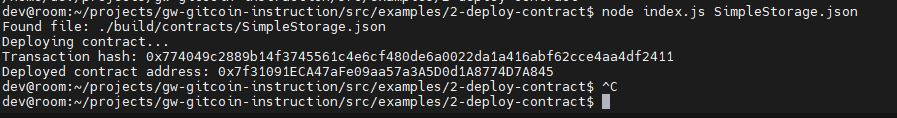

## 1. A screenshot of the console output immediately after you have successfully deployed a smart contract.

## 2. The transaction hash from the contract deployment (in text format).
0x774049c2889b14f3745561c4e6cf480de6a0022da1a416abf62cce4aa4df2411
## 3. The deployed contract address from the contract deployment (in text format).
0x7f31091ECA47aFe09aa57a3A5D0d1A8774D7A845