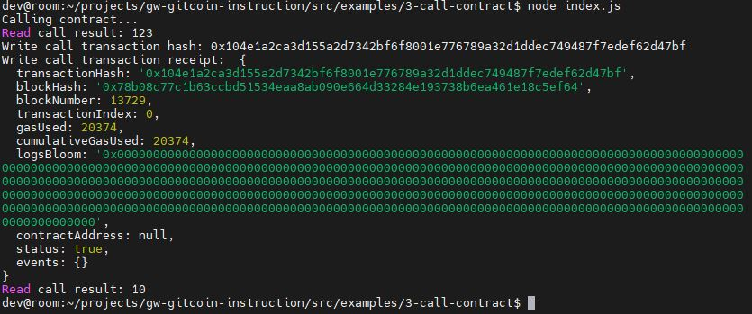

## 1.A screenshot of the console output immediately after you have successfully issued a smart contract call..

## 2. The transaction hash from the contract deployment (in text format).
0x104e1a2ca3d155a2d7342bf6f8001e776789a32d1ddec749487f7edef62d47bf
## 3. The contract address that you called (in text format).
0x7f31091ECA47aFe09aa57a3A5D0d1A8774D7A845
## 4.The ABI for contract you made a call on (in text format).
[
    {
      "inputs": [],
      "stateMutability": "payable",
      "type": "constructor"
    },
    {
      "inputs": [
        {
          "internalType": "uint256",
          "name": "x",
          "type": "uint256"
        }
      ],
      "name": "set",
      "outputs": [],
      "stateMutability": "payable",
      "type": "function"
    },
    {
      "inputs": [],
      "name": "get",
      "outputs": [
        {
          "internalType": "uint256",
          "name": "",
          "type": "uint256"
        }
      ],
      "stateMutability": "view",
      "type": "function"
    }
]