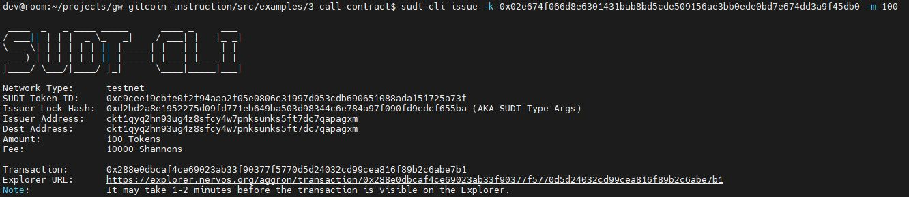
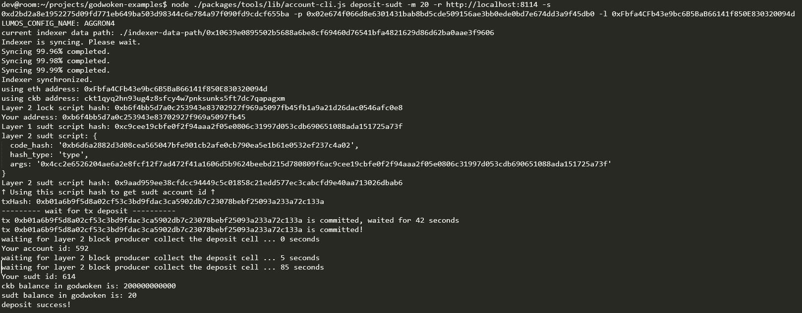

## 1. A link to the Layer 1 address you funded on the Testnet Explorer.
https://explorer.nervos.org/aggron/address/ckt1qyq2hn93ug4z8sfcy4w7pnksunks5ft7dc7qapagxm
## 2. A screenshot of the console output immediately after using sudt-cli to create your SUDT tokens on Layer 1.

## 3. A link to the transaction ID created by sudt-cli on the Testnet Explorer.
https://explorer.nervos.org/aggron/transaction/0x288e0dbcaf4ce69023ab33f90377f5770d5d24032cd99cea816f89b2c6abe7b1
## 4. A screenshot of the console output immediately after you have successfully submitted a deposit to Layer 2 using the account-cli tool.

## 5.The SUDT ID from the console output after executing the deposit script (in text format).
614
