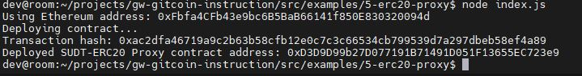
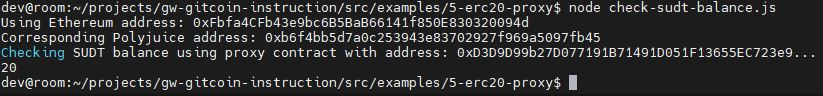

## A screenshot of the console output immediately after deploying smart contract.

## The address of the ERC20 Proxy Contract you deployed (in text format).
0xD3D9D99b27D077191B71491D051F13655EC723e9
## A screenshot of the console output immediately after checking your SUDT balance.

## The Ethereum address that was checked (in text format).
0xFbfa4CFb43e9bc6B5BaB66141f850E830320094d