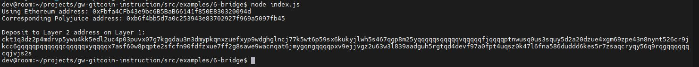

## 1. A screenshot of the console output immediately after you have successfully generated your Deposit Receiver Address.

## 2. Your Deposit Receiver Address (in text format).
ckt1q3dz2p4mdrvp5ywu4kk5edl2uc4p03puvx07g7kgqdau3n3dmypkqnxzuefxyp9wdghglncj77k5wt6p59sx6kukyjlwh5s467qgp8m25yqqqqqsqqqqqvqqqqqfjqqqqptnwusq0us3squy5d2a20dzue4xgm69zpe43n8nynt526cr9jkcc6gqqqqpqqqqqqcqqqqqxyqqqqx7asf60w8pqpte2sfcfn90fdfzxue7ff2g8sawe9wacnqat6jmygqngqqqqpxv9ejjvgz2u63w3l839aadguh5rgtqd4devf97a0fpt4uqsz0k47l6fna586duddd6kes5r7zsaqcryqy56q9rqgqqqqqqcqjvjs2s
## 3. The Ethereum address used to generate the Deposit Receiver Address (in text format).
0xFbfa4CFb43e9bc6B5BaB66141f850E830320094d
## 4. A link to the Etherscan explorer for the successful Force Bridge transaction. This can be found on Force Bridge under History→Succeed.
https://rinkeby.etherscan.io/tx/0x0b7a49bf7f03f9197d231b03df1dea0aee34ae49889ece3e9b603c44e8a71286
## 5. A link to the Nervos explorer for the successful Force bridge transaction. This can be found on Force Bridge under History→Succeed.
https://explorer.nervos.org/aggron/transaction/0xbf46695deb9c6fd5f9306924bebe5ce2a78d8edef1939b8566bb010302d74ccc
