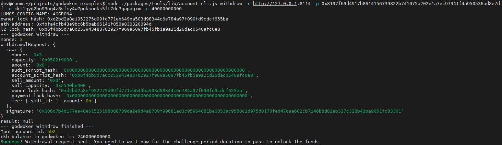

## 1. A screenshot of the console output immediately after running the withdraw command.

## 2. The Ethereum address that you've used for your Layer 2 account (in text format).
0xFbfa4CFb43e9bc6B5BaB66141f850E830320094d
## 3. The Nervos Layer 1 address that you passed to withdraw command (in text format).
ckt1qyq2hn93ug4z8sfcy4w7pnksunks5ft7dc7qapagxm